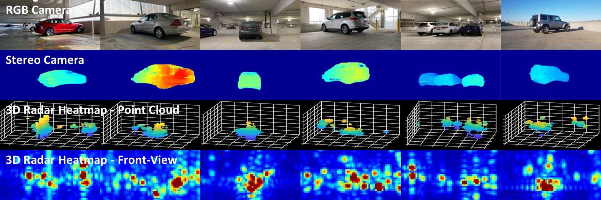

# HawkEye Dataset & Radar Data Synthesizer
3D Millimteer-wave radar heatmap dataset of cars collected using our custom-built radar data collection platform.
Matlab implementation of our radar data synthesizer.
<br><br>
[Through Fog High Resolution Imaging Using Millimeter Wave Radar](https://jaydeng1019.github.io/HawkEye/)  
Junfeng Guan, Sohrab Madani, Suraj Jog, Saurabh Gupta, Haitham Hassanieh
In [CVPR 2020](https://openaccess.thecvf.com/content_CVPR_2020/html/Guan_Through_Fog_High-Resolution_Imaging_Using_Millimeter_Wave_Radar_CVPR_2020_paper.html).  

<figure class="image">

</figure>

## Directory Structure
    .
    ├── Dataset                         
      ├── camera                        # RGB camera images
      ├── documentation                 # Document for HawkEye Dataset
      ├── radar                         # 3D mmWave radar heatmaps
      ├── stereo camera                 # Stereo camera depth-maps
    ├── Synthesizer                   
      ├── CAD                           # CAD models of cars
      ├── documentation                 # Document for HawkEye Radar Data Synthesizer
      ├── scripts                       # Various setup scripts for mmwavestudio, etc
        ├── functions    
          ├── model_point_reflector.m   # model radar point reflectors in the scene          
          ├── radar_dsp.m               # radar signal processing, generating 3D radar heatmaps
          ├── remove_occlusion.m        # remove occluded body of the car
          ├── simulate_radar_signal.m   # simulate received radar signals in the receiver antenna array  
        ├── main.m                      # main radar data simulation function
        ├── variable_library.m          # library of various variables
        ├── variable_library_radar.m    # radar configuration related variables
      ├── COPYRIGHT.txt
    ├── README.md


## Contact

    - Please submit issues to our [GitHub](https://github.com/JaydenG1019/HawkEye-Synthesizer) if you found any bugs or have any suggestions
    - For anything else, send an email at jguan8@illinois.edu


## Citation

Please cite our paper in your publications if it helps your research. Here is an example BibTeX entry:

```
@InProceedings{Guan_2020_CVPR,
author = {Guan, Junfeng and Madani, Sohrab and Jog, Suraj and Gupta, Saurabh and Hassanieh, Haitham},
title = {Through Fog High-Resolution Imaging Using Millimeter Wave Radar},
booktitle = {IEEE/CVF Conference on Computer Vision and Pattern Recognition (CVPR)},
month = {June},
year = {2020}
}
```
